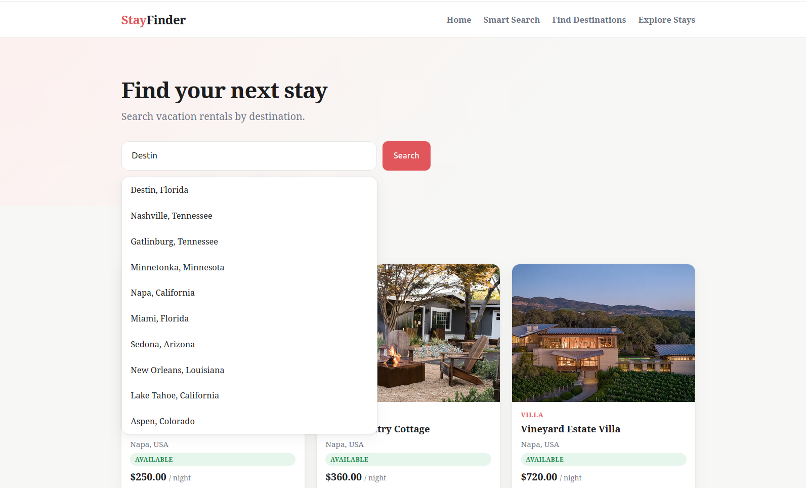
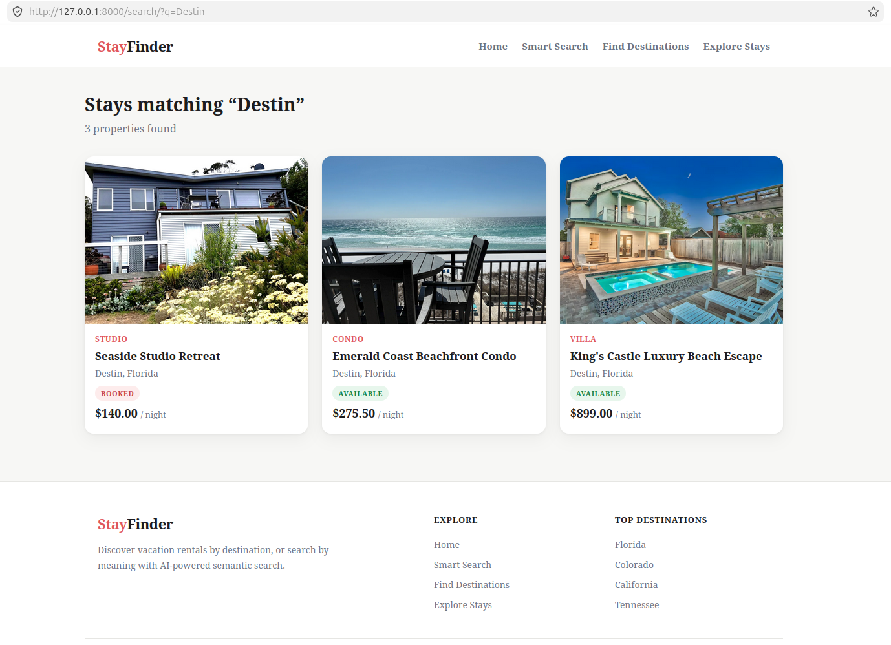
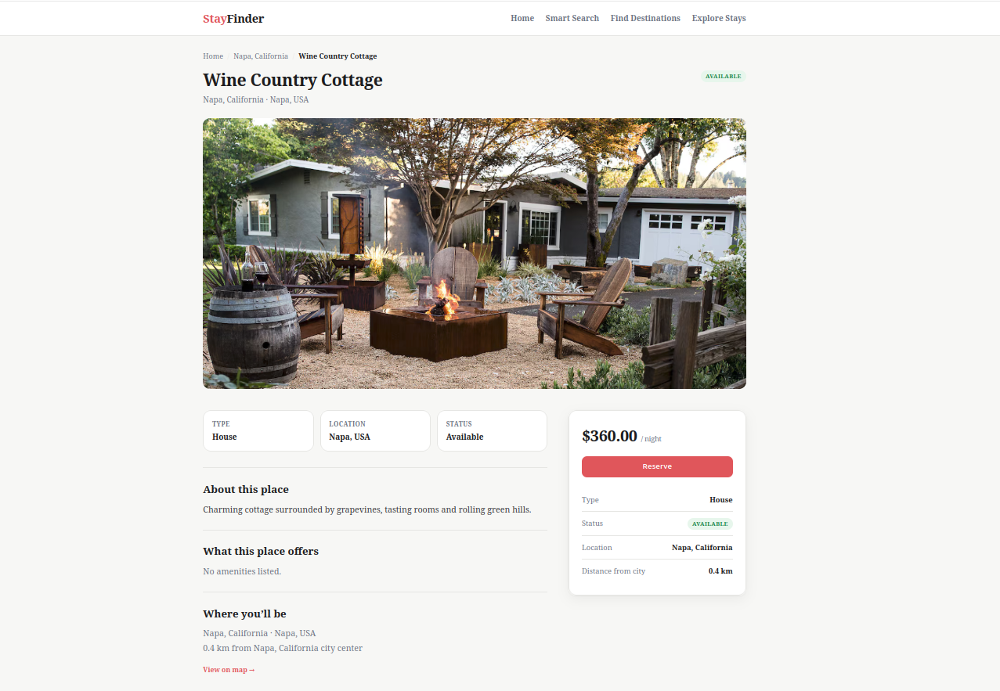
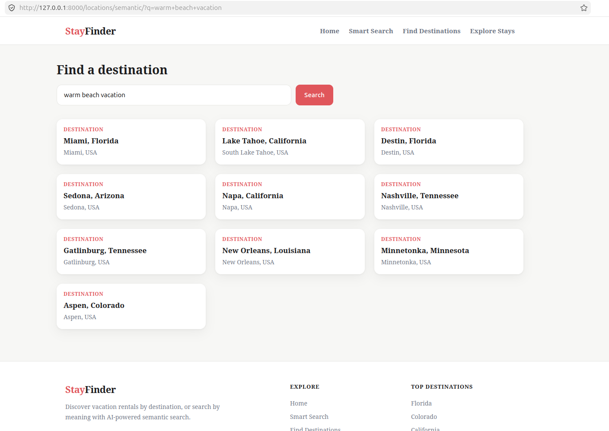
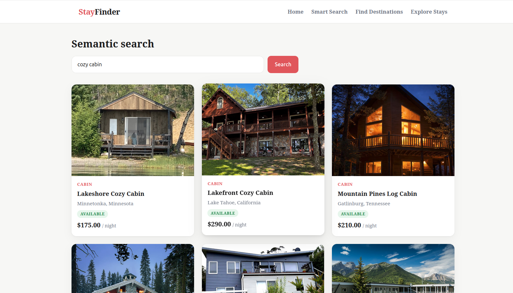
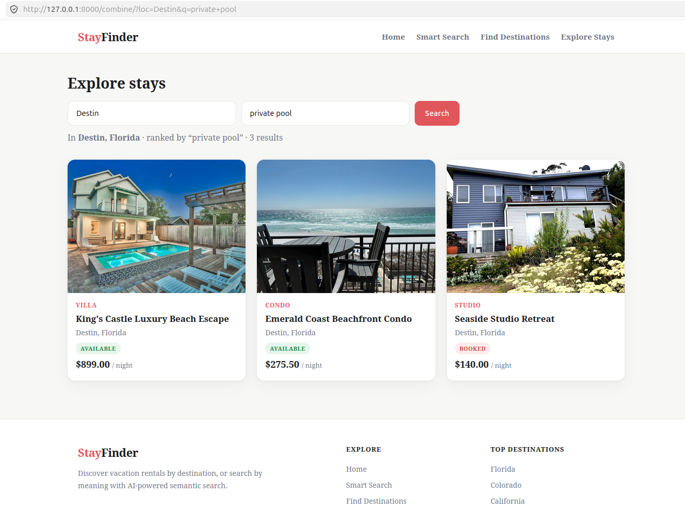

# Property Management System

A vacation-rental management platform that brings together two approaches to property search: traditional location-based search, and AI-powered semantic search that understands intent. Users can browse listings the conventional way — selecting a destination and scrolling through properties — or search by description, entering phrases like "beach vacation" or "mountain getaway" and getting relevant results even when those exact terms never appear in the data.

The stack is built on **Django**, using **GeoDjango / PostGIS** for spatial features and **pgvector** for semantic search, with embeddings generated by Sentence Transformers. The entire system runs in Docker, so setup comes down to a single command and a brief wait on the first launch.

Alongside search, the platform provides property detail pages with image galleries and amenities, and each listing reports its distance from the city center — computed accurately with PostGIS rather than approximated with raw coordinate math.

---

## Table of Contents

- [Tech Stack](#tech-stack)
- [Features](#features)
- [Screenshots](#screenshots)
- [Requirements](#requirements)
- [Setup](#setup)
- [API Endpoints](#api-endpoints)
- [Trying the Semantic Features](#trying-the-semantic-features)
- [Managing Data Manually](#managing-data-manually)
- [Running Tests](#running-tests)
- [Project Structure](#project-structure)
- [Useful Docker Commands](#useful-docker-commands)
- [Limitations & Future Improvements](#limitations--future-improvements)
- [Troubleshooting](#troubleshooting)
- [Author](#author)

---

## Tech Stack

| Layer | Technology |
|-------|-----------|
| Backend | Django, Django REST Framework |
| Spatial | GeoDjango + PostGIS |
| Vector / AI | pgvector + Sentence Transformers (`all-MiniLM-L6-v2`) |
| Database | PostgreSQL 16 (PostGIS 3.5, pgvector 0.8) |
| Data import | pandas |
| Containerization | Docker + Docker Compose |

---

## Features

The platform's core capabilities:

- **Location-based search.** Find properties by destination, with pagination so long result lists stay manageable.
- **Property detail pages.** Each one has an image gallery, the amenities, the price, and the distance from the city center (computed with PostGIS).
- **Semantic location search.** Ranks destinations by meaning using vector embeddings instead of string matching.
- **Semantic autocomplete API.** A DRF endpoint that suggests locations based on how close they are in meaning to what you typed.
- **Combined search.** Filter by location *and* rank what's left semantically — best of both worlds.
- **Django admin.** Manage everything with filters and inline image previews.
- **HNSW vector indexing.** Fast approximate nearest-neighbor search inside pgvector.

### Technical highlights

- **Real spatial data, not approximations.** `Location` and `Property` use PostGIS `geography` point fields (SRID 4326), along with a `MultiPolygonField` for boundaries. Distance calculations are genuinely metric rather than naive coordinate subtraction.
- **Coordinates stay in sync automatically.** A reusable `PointSyncMixin` updates each model's spatial `point` from its latitude/longitude on save. Data entry stays simple, spatial queries stay correct, and the two never need to be aligned by hand.
- **Amenities stored as a Postgres array.** Rather than a separate table, amenities sit in a native `ArrayField`, keeping the schema lean.
- **Self-seeding setup.** On first boot the Docker entrypoint waits for the database, runs migrations, imports the sample data, and generates embeddings automatically. Guards ensure that restarts never duplicate data or repeat the slow model load.
- **Lean, reproducible image.** PyTorch is pinned to the CPU-only build, and the main AI dependencies are version-pinned to avoid pulling unnecessary GPU libraries.
- **Resilient startup.** Embedding generation is treated as non-fatal, so the app still launches even when the model can't be downloaded — semantic results simply remain empty until embeddings are generated.

---

## Screenshots

### Homepage with Search


### Location Search Results


### Property Detail (images, amenities, and distance from city)


### Semantic Location Search


### Property Semantic Search


### Combined Location + Semantic Search


---

## Requirements

You'll need:

- Docker Desktop
- Docker Compose
- A few GB of free disk space — the image bundles PyTorch for the embeddings
- An internet connection on the first run, so it can grab the embedding model (~90 MB)

---

## Setup

### 1. Create a `.env` file

Copy the example and tweak anything you like:

```bash
cp .env.example .env
```

It should end up looking like this:

```env
SECRET_KEY=replace-this-with-a-long-random-secret-key
DEBUG=True

DB_NAME=vacation_rental
DB_USER=postgres
DB_PASSWORD=postgres
DB_HOST=db
DB_PORT=5432
```

One thing to leave alone: keep `DB_HOST=db`. That `db` is the name of the PostgreSQL service in `docker-compose.yml`, so changing it will break the connection.

Need a fresh secret key? This will print one:

```bash
docker compose run --rm web python -c "from django.core.management.utils import get_random_secret_key; print(get_random_secret_key())"
```

### 2. Build and start

From the project root:

```bash
docker compose up --build -d
```

The very first time you run this, the container quietly does a bunch of work for you:

1. Waits until PostgreSQL is actually ready
2. Applies the database migrations
3. Imports the sample properties from `data/vacation_rentals.csv`
4. Generates semantic embeddings for the properties and locations

> **Give the first launch about a minute.** It's downloading the embedding model and crunching vectors, which only happens once — every restart after that is quick because it skips these steps. And if the embedding step fails (say you're offline), don't panic: the app still starts, semantic search is just empty until you generate the embeddings yourself.

### 3. Create an admin user

```bash
docker compose exec web python manage.py createsuperuser
```

### 4. Open the app

| Page | URL |
|------|-----|
| Homepage | http://127.0.0.1:8000/ |
| Property search | http://127.0.0.1:8000/search/ |
| Property detail | http://127.0.0.1:8000/property/&lt;slug&gt;/ |
| Semantic location search | http://127.0.0.1:8000/locations/semantic/ |
| Combined search | http://127.0.0.1:8000/combine/ |
| Autocomplete API (semantic) | http://127.0.0.1:8000/api/locations/?q=beach |
| Django admin | http://127.0.0.1:8000/admin/ |

---

## API Endpoints

There's one REST endpoint, built with **Django REST Framework**.

### Location Autocomplete (Semantic)

Give it a query and it returns up to 10 locations, ranked by how semantically close they are to what you asked for (using the vector embeddings and cosine distance).

| | |
|---|---|
| **Method** | `GET` |
| **URL** | `/api/locations/` |
| **Query param** | `q` — the text you're searching for (e.g. `beach`, `mountain`) |

**Example request:**

```
GET /api/locations/?q=beach
```

**Example response:**

```json
{
  "results": [
    { "label": "Miami, Florida", "slug": "miami-florida" },
    { "label": "Destin, Florida", "slug": "destin-florida" }
  ]
}
```

If `q` is empty or missing, you just get `{"results": []}` back.

---

## Trying the Semantic Features

The whole point here is that search runs on *meaning*, so descriptive phrases work better than exact names. Some things worth trying:

- In the **homepage search box**, type `beach` or `mountain` and watch the autocomplete suggest matching destinations.
- On **semantic location search** (`/locations/semantic/`), try something like `warm beach vacation`, `mountain ski getaway`, or `wine country`.
- On **combined search** (`/combine/`), give it a place (e.g. `Aspen`) and a vibe (e.g. `luxury lodge with sauna`) — it'll filter by the place and then rank by meaning.

---

## Managing Data Manually

All of this runs automatically on first startup, but here's how to do it by hand if you ever need to.

Import properties from the CSV:

```bash
docker compose exec web python manage.py import_properties data/vacation_rentals.csv
```

Generate embeddings (it only fills in the missing ones, so re-running is safe):

```bash
docker compose exec web python manage.py generate_embeddings
docker compose exec web python manage.py generate_location_embeddings
```

> The importer skips properties that already exist instead of duplicating them, and the embedding commands only touch records that don't have an embedding yet. So you can run any of these again without worrying.

---

## Running Tests

There's an automated test suite covering the spatial point-sync logic, location-based search, and the semantic autocomplete ranking. The embedding model is mocked in the tests, so they run fast and give the same result every time.

Run them inside the container:

```bash
docker compose exec web python manage.py test
```

Among other things, the tests confirm that:

- saving a model auto-populates its PostGIS `point` from the latitude/longitude,
- slug search returns only the chosen location while text search spans every match,
- the autocomplete API ranks by cosine distance and handles empty queries gracefully.

---

## Project Structure

```
.
├── config/                  # Django project settings, URLs
├── property_app/            # Main app
│   ├── models.py            # Location, Property, PropertyImage
│   ├── views.py             # Search, detail, semantic, combined views
│   ├── serializers.py       # DRF serializer for autocomplete API
│   ├── embeddings.py        # Shared Sentence Transformers helpers
│   ├── admin.py             # Admin with filters and image previews
│   ├── management/commands/ # import_properties, generate_embeddings, ...
│   ├── migrations/
│   └── tests.py             # Point-sync, search, and autocomplete tests
├── templates/property_app/  # HTML templates
├── static/                  # CSS and JS (autocomplete)
├── data/                    # Sample CSV and property images
├── docker/                  # Postgres image + entrypoint script
├── docker-compose.yml
├── Dockerfile
└── requirements.txt
```

---

## Useful Docker Commands

A handful you'll reach for often:

```bash
docker compose ps                 # list running containers
docker compose logs -f web        # follow Django logs
docker compose logs -f db         # follow database logs
docker compose restart web        # restart the Django container
docker compose down               # stop containers (keeps data)
docker compose down -v            # stop containers and DELETE the database
```

A word of caution on that last one: `docker compose down -v` wipes the database. Only use it when you actually want a clean slate — it'll re-seed and re-generate embeddings the next time you start up.

---

## Limitations & Future Improvements

A couple of things I'd like to get to:

- **Image similarity search.** The schema and stack already support image embeddings, so a "find similar-looking properties" feature is a natural next step.
- **Richer spatial queries.** The PostGIS foundation makes radius search, polygon containment, and geofencing very doable — which could turn into proper map-based browsing down the line.

---

## Troubleshooting

**Page shows `ERR_EMPTY_RESPONSE`** — the web container probably started before PostgreSQL finished initializing. A restart usually sorts it:

```bash
docker compose restart web
```

**Semantic search returns nothing** — the embeddings likely never got generated (often because the first-run download failed). Generate them by hand:

```bash
docker compose exec web python manage.py generate_embeddings
docker compose exec web python manage.py generate_location_embeddings
```

**Build fails during `apt-get` / `dpkg`** — make sure Docker Desktop is running and you've got enough free disk space.

**Duplicate properties showing up** — this happens when the import runs more than once against an already-seeded database. Clear it out and re-import:

```bash
docker compose exec web python manage.py shell -c "from property_app.models import Property, PropertyImage, Location; PropertyImage.objects.all().delete(); Property.objects.all().delete(); Location.objects.all().delete()"
docker compose exec web python manage.py import_properties data/vacation_rentals.csv
docker compose exec web python manage.py generate_embeddings
docker compose exec web python manage.py generate_location_embeddings
```

---

## Author

**[Naimur Rahman Lam](https://github.com/NaimurRahmannn)**